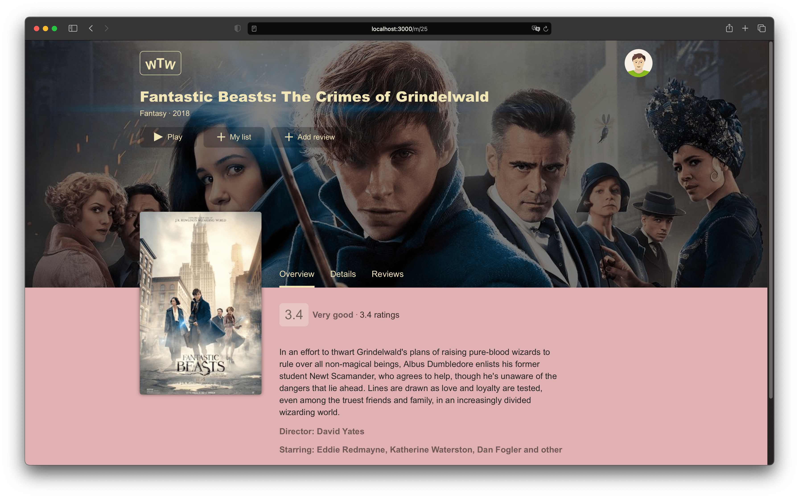
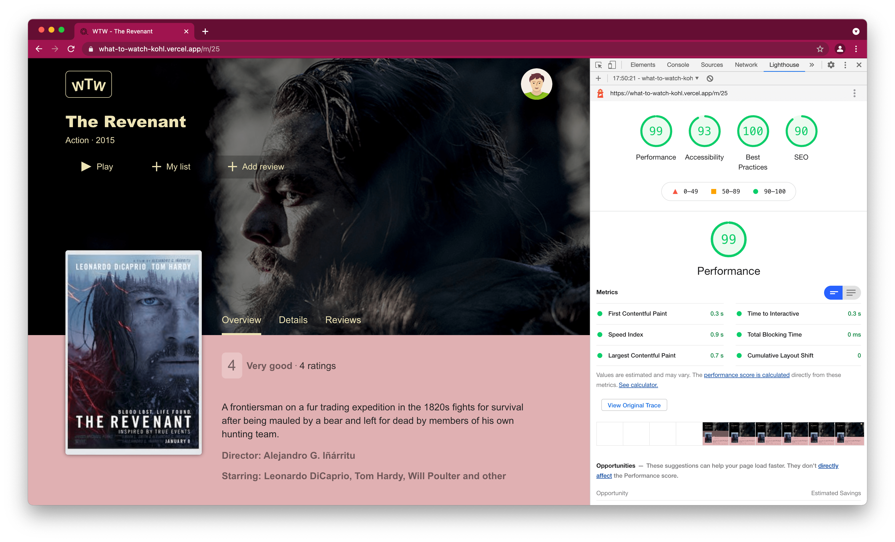
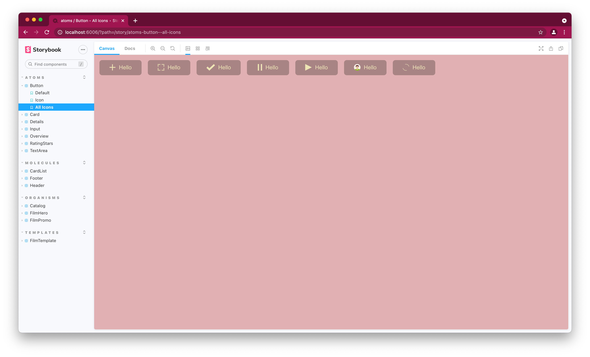

# what-to-watch



Demo site: https://what-to-watch-kohl.vercel.app

---

## Stack

- Typescript
- NextJS
- MobX
- Linaria
- SEO
- BFF Proxy
- Storybook



## Quick start with Docker

```sh
docker build -t wtw .
docker run --init --rm -itp 3000:3000 wtw
# http://localhost:3000
# `ctrl + c` - for exit
```

## Local develop

```sh
yarn     # install deps
yarn dev # -> app:       http://localhost:3000/
yarn sb  # -> storybook: http://localhost:6006/
```



## TO-DO

- [ ] Normal Auth (current working until refresh)
- [ ] 404 page on dynamic routes
- [ ] Save url to redirect after login
- [ ] Store errors handling
- [ ] Formik (for 2 inputs?... meeeehh)
